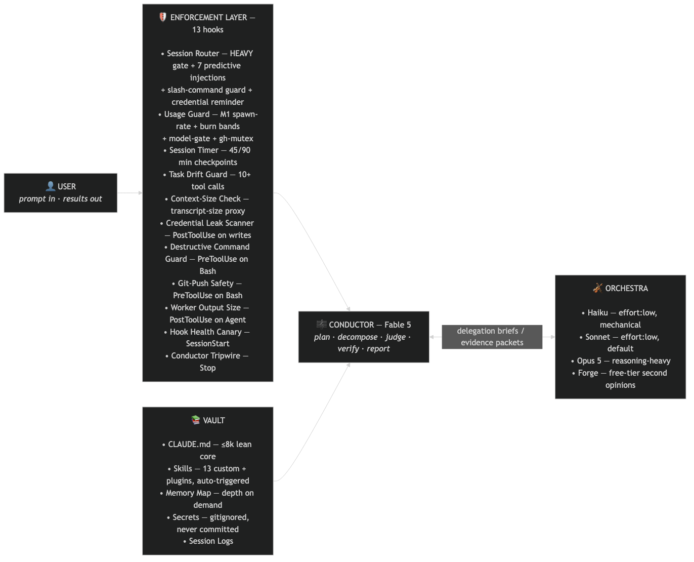
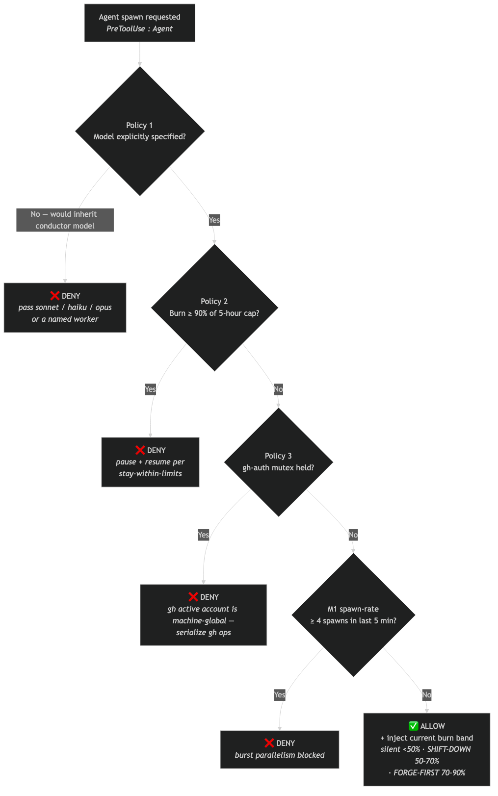
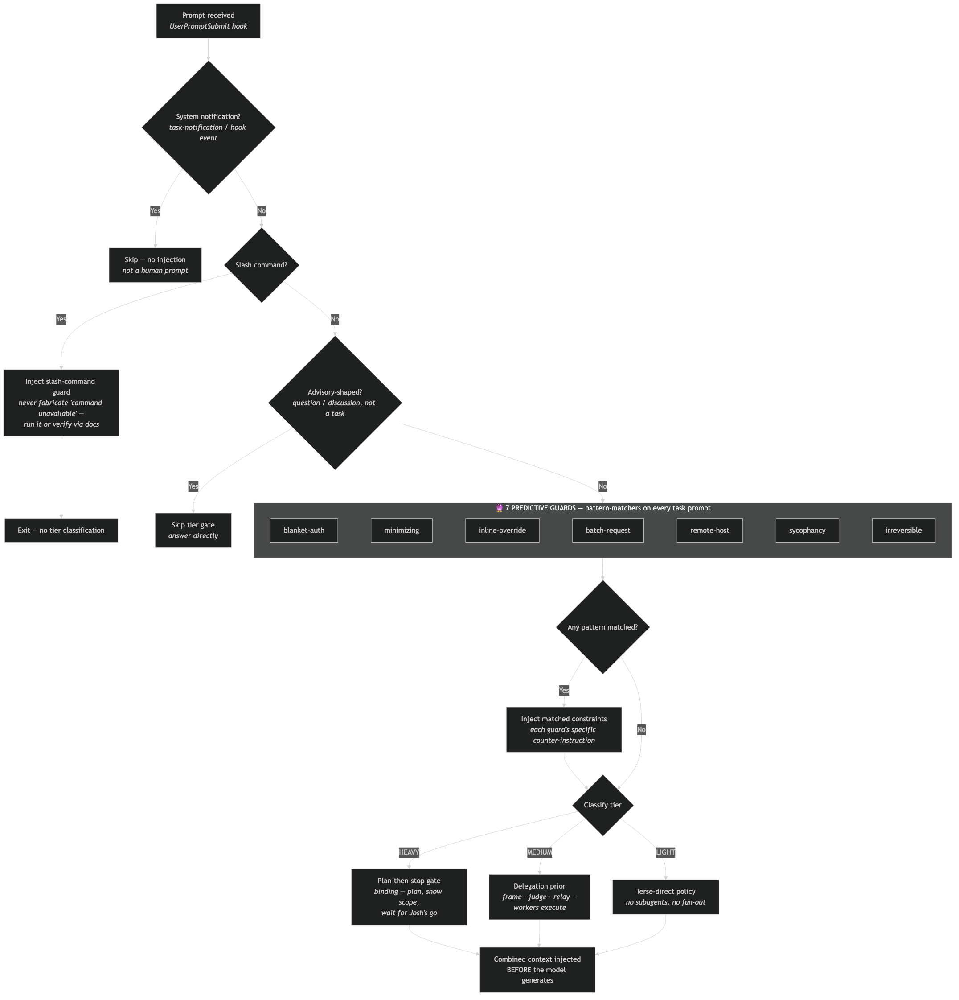
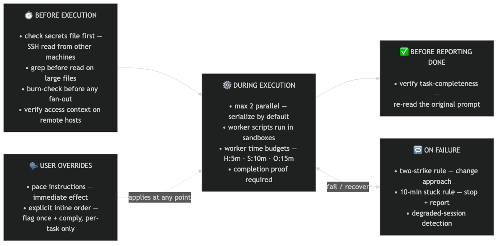
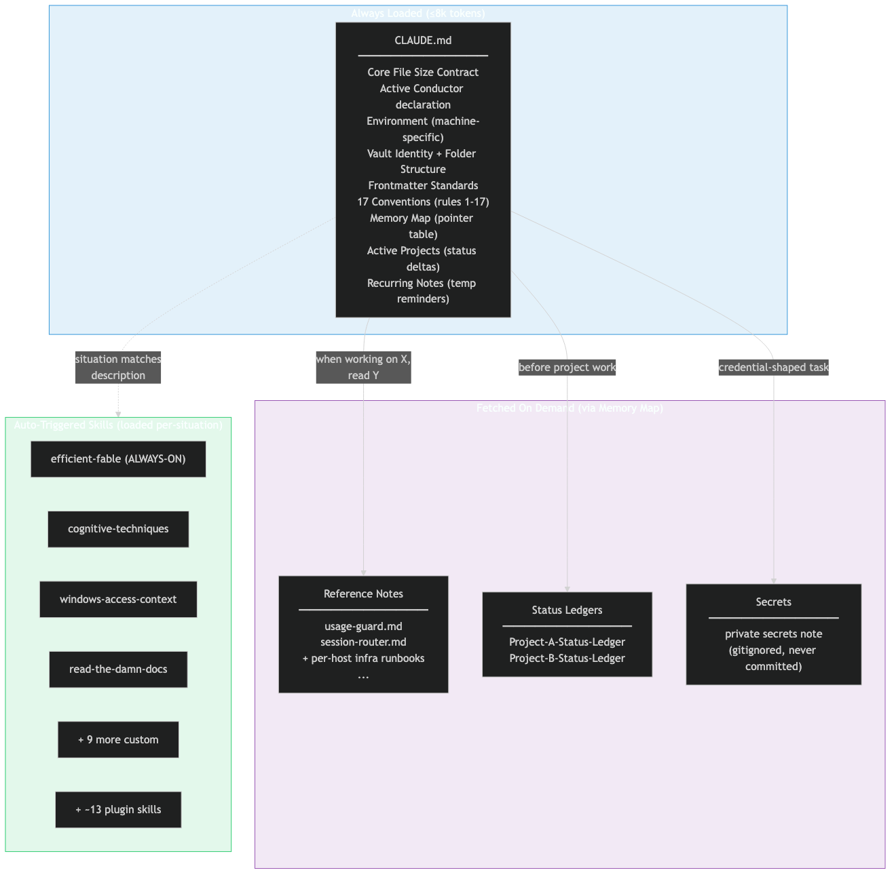
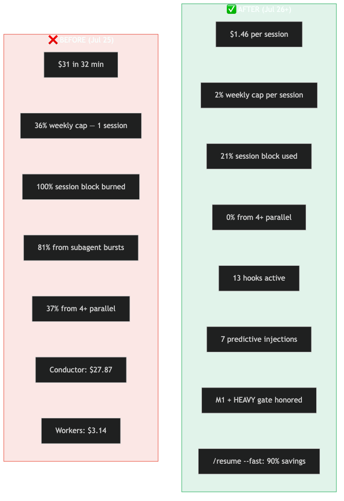
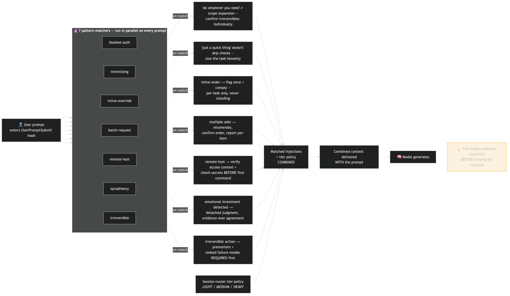

# claude-config — Enforced Runtime

A portable, public [Claude Code](https://claude.com/claude-code) configuration. The repo
*is* `~/.claude/` on each machine, tracking only an allowlisted, non-secret slice.

Its distinguishing idea: **turn agent-operation conventions into executable enforcement.**
Most operating frameworks document how an agent *should* behave (token discipline, routing,
delegation) and trust it to comply. This one wires those rules into **hooks** — the agent is
*blocked* from the failure mode, not merely *asked* to avoid it. An unbounded fan-out can
silently spawn many expensive subagents and exhaust a usage window quickly; the guard hook
makes that limit mechanical rather than aspirational.

**Prerequisite:** this config assumes a working Obsidian vault with the Claude Code CLI
installed and running from the vault root. Starting from scratch? Do the
[Obsidian + Claude Code setup guide](https://joshuasutcliff.com/guides/obsidian-claude-setup)
first — it covers installation on macOS, Windows, and Linux, plus a starter `CLAUDE.md`.

Start with **`AGENT.md`** (the operating contract), then **`_index.md`** (asset registry) and
**`docs/ARCHITECTURE.md`** (the layered design).

---

## The system in seven diagrams

Six diagrams cover the whole design — what runs where, what is mechanically enforced versus behaviorally expected, and what the enforcement layer measurably changed. They are drawn for both audiences: if you are new to agent orchestration, read each **What it shows** first; if you run agent fleets yourself, the **Why it's built this way** notes carry the design rationale and the incidents behind it.

### 1. Master architecture — one prompt, end to end



**What it shows:** The full life of a request. A user prompt first passes through four enforcement hooks — the session router (classifies the prompt's weight), the usage guard (budget and spawn-rate limits), the session timer (long-session nudges), and the conductor tripwire (flags execution-shaped output) — which inject policy into context before the model acts. It then reaches the conductor, the frontier model whose only job is judgment: plan, decompose, delegate, verify, synthesize, report. All bounded execution goes to a tiered pool of cheaper workers — Haiku for mechanical work, Sonnet as the default executor, Opus for reasoning-heavy bounded tasks, and a free-tier model for second opinions — whose results flow back (dotted lines) for the conductor to re-verify. An Obsidian vault serves as persistent memory across sessions.

**Why it's built this way:** Frontier-model tokens are the most expensive resource in the loop. Spending them exclusively on judgment while cheaper models handle volume work is what makes the system 3–5× more cost-efficient — but that split only holds if something enforces it, which is what the hook layer is for. The model asked nicely does not stay disciplined; the model blocked by a shell script does.

### 2. Hook enforcement flow — every subagent spawn runs this gauntlet



**What it shows:** The gate sequence a subagent spawn must clear. Policy 1 denies any spawn that fails to name an explicit worker model, so nothing silently inherits the expensive conductor model. Policy 2 denies all spawns once usage reaches 90% of the cap. Policy 3 is a mutex that serializes workers touching machine-global GitHub-account state, because concurrent account switches land writes under the wrong identity. M1 is a rate limiter: more than 4 spawns in 5 minutes trips a circuit breaker. Only a spawn that clears all four gates runs — and even then the hook injects the current budget-burn band into context so the delegation decision is made with the price tag visible.

**Why it's built this way:** Each gate is a scar. The rate limiter exists because one parallel fan-out burned 36% of a weekly usage cap in 32 minutes. Written rules against exactly that had failed three times before — the model that writes a rule can also rationalize around it, but it cannot rationalize around a script that returns "deny."

### 3. Session router — right-sizing the response before any work starts



**What it shows:** A hook that classifies every incoming prompt before the model sees it. System notifications and advisory questions pass through untouched. Everything else is routed by keyword and length heuristics into three tiers: LIGHT (answer directly, no subagents), MEDIUM (delegate the heavy lifting to cheap workers), or HEAVY — which triggers a binding plan-then-stop gate: state the scope, list atomic steps, estimate cost, and stop for approval before executing anything. Prompts that look credential-shaped get an extra injected reminder to check the local secrets store before asking the user for passwords or keys.

**Why it's built this way:** The two expensive failure modes are opposites: burning frontier tokens over-answering a cheap question, and diving into a large job without an approved plan. Both are cheapest to correct before the first token is spent, so the classification happens at prompt-submit time — the one point where the cost of every downstream decision is still zero.

### 4. Conductor behavioral rules — the behavioral layer above the hooks



**What it shows:** The rules the conductor follows that hooks cannot mechanically check, grouped by when they bind. Before execution: check the stored secrets before asking the user, grep large files instead of reading them whole, check budget burn before any fan-out. During: a hard ceiling of 2 parallel workers, serialize by default, worker scripts run in sandboxes rather than live repos, and every worker gets a time budget by tier. On failure: a two-strike rule (never dispatch a third worker at the same failed task), a 10-minute stuck rule (report rather than wait silently), and degraded-session detection that recommends a fresh start. User overrides: pace instructions ("slow down", "one at a time") take effect immediately, and an explicit user order to execute inline is honored — but flagged once, so overrides stay visible and cannot silently erode the policy.

**Why it's built this way:** Every rule here traces to a specific logged incident — a destroyed in-progress edit, an hour wasted waiting on a stranded worker, a runaway parallel burst. Hooks catch what a script can detect; the field rules encode the postmortem lessons that require judgment to apply. Nothing in this box is aspirational best practice — it is all scar tissue with a date attached.

### 5. CLAUDE.md lean core — memory as a paging system



**What it shows:** The three-tier memory architecture. The always-loaded core file is capped at 8,000 tokens and holds only what every session needs: identity, the behavioral rules, active-project deltas, and — critically — a pointer table (the "memory map") naming which reference note to fetch for which kind of work. Depth lives in those on-demand notes: per-system runbooks, project status ledgers, and a gitignored secrets store. Skills (packaged procedures) load themselves when a situation matches their trigger description rather than sitting in context permanently.

**Why it's built this way:** An always-loaded instruction file is a recurring tax — every line is paid for again at every session start, forever. Capping the core and pushing depth behind pointers makes context pay-per-use: a session doing website work never pays for the home-lab runbook. It is the same idea as paging in operating systems — keep the working set small, fault the rest in on demand.

### 6. Before and after — what the enforcement layer measurably changed



**What it shows:** The measured effect of turning written rules into enforced ones. Before (July 25): a single runaway session spent $31 in 32 minutes — 36% of a weekly usage cap — with 81% of the spend coming from subagent bursts and the conductor doing $27.87 of the work itself instead of delegating. After (July 26 onward): sessions average $1.46, about 2% of the weekly cap each, with zero 4-plus-parallel bursts; the rate limiter has fired and held, and the heavy-task approval gate has been honored every time it triggered.

**Why it's built this way:** These numbers are the falsifiability of the whole design. Anyone can claim their agent framework saves money; this one keeps the incident that motivated the enforcement layer and the before/after measurements in the open — roughly a 95% reduction in cost per session on comparable work. The raw dollar figures stay because "trust me, it's cheaper" is exactly the kind of unverifiable claim the config bans internally.

### 7. Predictive injections — constraints arrive before generation



Seven pattern-matchers run on every prompt — blanket authorization, minimizing language, inline-override requests, batched asks, remote-host work, sycophancy bait, and irreversible actions. Each match injects its counter-constraint into context ahead of generation, so the model reads the rule before it forms the response instead of being corrected after.

---

## Obsidian + Claude quick start

This repo also documents a full **Obsidian-vault-as-memory-backend** workflow — session
lifecycle (`/resume` → work → `/wrap`), frontmatter-driven surfacing, daily/weekly notes, project
scaffolding, and more. If you want that:

1. Clone this repo (or point an existing Claude Code session at it).
2. Tell Claude: *"Read `docs/OBSIDIAN-SETUP.md` and integrate this into my setup."*
3. Claude will walk through copying commands/skills/agents/hooks into `~/.claude/`, wiring
   `settings.example.json`, scaffolding your vault folders, and adapting
   `templates/CLAUDE.vault.example.md` into your vault's own `CLAUDE.md` — asking you for your
   real paths/usernames along the way.

See `docs/OBSIDIAN-SETUP.md` for the full guide, including which pieces (multi-machine sync,
usage-guard, session-router) are optional.

---

## One-click install

Prefer a single command over the manual walkthrough? These scripts automate Steps 1-4 above
(install Obsidian, install Claude Code, create your vault folder, write a starter `CLAUDE.md`).

- macOS/Linux: `curl -fsSL https://raw.githubusercontent.com/joshuadsutcliff/claude-config-public/main/scripts/install.sh | bash`
- Windows (PowerShell): `irm https://raw.githubusercontent.com/joshuadsutcliff/claude-config-public/main/scripts/install.ps1 | iex`

Each script detects what's already installed and skips it, asks for your vault path (with a
sensible default), and never overwrites an existing `CLAUDE.md`. Safe to run more than once.

---

## What's here

| Path | Contents |
|---|---|
| `AGENT.md` | Root operating contract — conductor/worker model + enforcement layer. |
| `_index.md` | Registry of every tracked asset. |
| `hooks/` | `usage-guard.sh` (usage-cap + conductor-model enforcement + the M1 spawn-rate limiter), `session-router.sh` (LIGHT/MEDIUM/HEAVY tier router with a binding HEAVY plan-then-stop gate), `conductor-tripwire.sh` (logs execution-shaped conductor output), `session-timer.sh` (PostToolUse hook: advisory 45/90-minute session-length nudges plus a degraded-session escalation at 90+ minutes AND 2+ worker failures; fail-open; `SESSION_TIMER_OFF=1` kill switch), `post-compact.sh` (re-grounds the model after auto-compaction). |
| `agents/` | Named delegation workers: `researcher`, `code-generator`, `tester`, plus `code-reviewer` (reviews completed work against its plan). |
| `commands/` | Session lifecycle: `/compress`, `/preserve`, `/resume`, `/wrap`, `/goal`. Vault workflow: `/sync-config`, `/sync-machine`, `/daily-note`, `/inbox-process`, `/meeting-note`, `/new-project`, `/weekly-review`. |
| `skills/` | Hand-authored cognitive-technique skills (auto-invoked): parallel-lens-synthesis, consequence-simulation, detached-judgment, pressure-test, nod-protocol. Hand-authored process skills: `grill-me`, `model-council`, `skill-evolution`. Also vendored upstream skills: `efficient-fable`, `quick-recap`, `stay-within-limits` (see "Skills" below). |
| `workflows/` | `phased-review.js` — capped, usage-gated spec-drift review. |
| `settings.example.json` | Shared hook wiring + `effortLevel` baseline. |
| `docs/` | `ARCHITECTURE.md` (the layered design), `DELEGATION-LADDER.md` (usage-adaptive routing incl. the free-model tier), `goal-loop-engineering.md` (Goal Contracts + Loop Specs), `OBSIDIAN-SETUP.md` (Claude-facing integration guide for the vault workflow). |
| `templates/` | `CLAUDE.vault.example.md` — fill-in-the-blanks vault-level CLAUDE.md. |

### Multi-machine sync is optional

Single-machine is the default: `/resume` and `/wrap` never touch a remote repo out
of the box. Multi-machine sync (vault + `~/.claude` mirrored across several
machines via GitHub) is an opt-in add-on — run **`/sync-machine`** on a second
machine to turn it on, which sets a flag file (`~/.claude/multi-machine`).
Once that flag exists, `/resume` picks up vault/config pulls automatically and
`/wrap` picks up the `/sync-config` step automatically — no other setup needed.
Delete the flag file to go back to single-machine behavior.

## The enforcement layer *(added 2026-07-26)*

Written rules failed three times. The conductor performed ~15 vault edits inline with no rule
firing; it inline-integrated a 250-line worker draft while designing the compliance tests for
that exact rule; and it ran a certification battery from inside its own session, burned 36% of
a weekly usage cap in 32 minutes, was told emphatically to stop, serialized, and kept 24 more
sessions running at full throughput.

The root cause is not ignorance: the model wrote the rules. Task-completion drive overrides
compliance drive when the model has momentum, and it will always construct a technically
compliant reading that permits continuing. That cannot be prompted away; it can only be
mechanically prevented.

The fix is a circuit breaker, not a better rule:

- **Spawn-rate limiter (M1)** — `usage-guard.sh` PreToolUse policy: more than 4 Agent/Workflow
  spawns in a rolling 5-minute window, machine-global, is a hard deny. The hook counts; it does
  not evaluate justifications.
- **Plan-then-stop gate** — `session-router.sh` classifies every prompt; HEAVY tasks get a
  binding injected constraint: state scope, list atomic steps, name the first, and STOP for the
  user's explicit go.
- **Conductor tripwire** — `conductor-tripwire.sh` flags execution-shaped conductor output
  (bulk edits, long inline code, scan loops). It logs rather than blocks: the observability
  layer.
- **Hard parallel ceiling** — never more than 2 concurrent subagents without explicit
  authorization; "prefer parallel when independent" is retired. M1 enforces it mechanically.

Voluntary compliance is a bonus, not the safety mechanism. When the hooks never fire the system
is working; when task pressure builds, the hooks are what protect the budget.

## Skills

The 5 hand-authored cognitive-technique skills in `skills/` (parallel-lens-synthesis,
consequence-simulation, detached-judgment, pressure-test, nod-protocol) are **included** here
(adapted from Compound AI Operating Standards, CC BY 4.0). They auto-invoke based on their
`description`.

Three hand-authored **process skills** (added 2026-07-18; original to this config,
community-inspired) are also included:

- `grill-me` — pointed requirements interrogation BEFORE brainstorming/planning, gated to
  genuinely underspecified requests.
- `model-council` — convenes 2-3 non-Claude models (OpenRouter free tier) as independent
  reviewers on high-stakes decisions, catching blind spots correlated across single-vendor review.
- `skill-evolution` — an observation log + batched, human-approved evolution passes for the
  skill library itself (ships without the private observation log; it's created on first use).

Three more skills are **vendored** from the upstream Claude Code skills distribution — copied in
full (including assets), marked with a provenance comment in each README, and may drift from
upstream over time:

- `efficient-fable` — conductor/worker delegation design.
- `quick-recap` — the 🟢/🟡/🔴 status-line convention.
- `stay-within-limits` — usage-aware pausing across work waves.

`visual-plan` and `visual-recap` (interactive plan/diff visualizations) remain **external** —
install them separately via Claude Code's plugin system; they are not redistributed here.

## Free-model tier & usage-adaptive routing *(added 2026-07-19)*

The conductor/worker ladder gained a fifth tier and a routing brain — see
**`docs/DELEGATION-LADDER.md`** for the full doctrine. The short version:

- **A free-model tier below the paid workers.** A bring-your-own-key terminal harness
  (e.g. [Forge](https://forgecode.dev)) running free-tier models — the shared OpenRouter
  `:free` pool for commodity traffic plus a **direct Gemini free-tier key** as a dedicated
  reserve quota immune to peak-hour pool congestion. It takes self-contained work only:
  second opinions, adjudication cross-checks, copy review. Zero paid tokens.
- **Usage-adaptive routing (Cascade-inspired).** Routing is keyed to the live usage signal
  the guard hook already computes: the busier the 5-hour window, the more eligible work
  shifts down-ladder — until, above the hard-block threshold, the free tier is the only
  lane still running.
- **A capability floor — "regulation, not degradation."** Repo/tool-dependent work,
  precision edits, and time-critical paths never route down regardless of burn, and every
  free-model verdict is a conductor-verified *lead*, never a final answer (empirically:
  free models catch inconsistency and over-claiming; they miss domain wrongness).
- **Spec-driven planning IDE as an adjacent lane.** A free-tier agentic IDE (e.g.
  [Kiro](https://kiro.dev)) is seeded with repo steering files and used for structured
  product-probe interviews — responses are captured into the memory vault, source-verified
  by a worker, and adjudicated by the conductor before anything changes a roadmap.

## Try it

```bash
git clone https://github.com/<your-username>/claude-config-public.git ~/claude-config-demo
# Inspect AGENT.md + hooks/. To actually run the hooks, wire settings.example.json
# into a ~/.claude/settings.json and restart Claude Code (hooks read once at startup).
```

The hooks are **bash + `python3`**. On Windows, run under Git Bash or WSL and confirm
`python3 --version` resolves (it's often just `python`). Hooks use `~`/`$HOME` only — no
absolute user paths. Per-machine values belong in a gitignored `settings.local.json`.

---

## ⚠️ Secrets policy (for anyone forking this layout)

This repo **must never contain secrets, credentials, or conversation history.** The intended
`.gitignore` is allowlist-style (ignore everything, re-include only safe paths) so that the
following are *never* committed: `~/.claude.json`, `.credentials.json`, auth caches,
`projects/` · `sessions/` · `history.jsonl` (transcripts), local caches/telemetry/backups, and
`settings.local.json` (the per-machine override layer). Before every commit, verify nothing
sensitive is staged.

## Provenance

This repo carries a SHA256 integrity manifest so anyone can confirm a copy is unmodified
(and detect forks). Regenerate it after changing any tracked file, and verify a clone with:

```bash
python3 scripts/build-manifest.py     # writes scripts/manifest.json + scripts/manifest.sha256
python3 scripts/verify-integrity.py   # re-hashes the tree; exits non-zero on any drift
```

## License & provenance

This is a public, scrubbed export of a personal configuration, shared for comparison and
reuse. No warranty. Adapt the vault-shaped commands (`/compress`, `/preserve`, `/resume`) to
your own memory backend — they assume a notes-vault-style long-term store.
